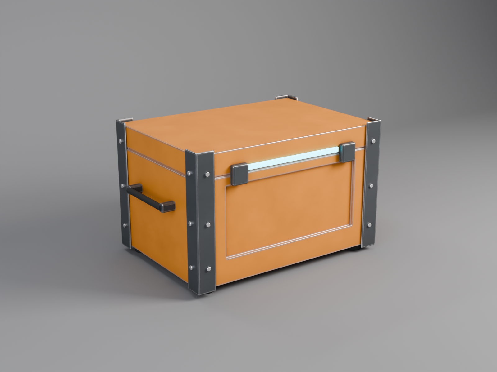

# 3d_doodle

Game-ready 3D models built from code with Blender, from idea to `.glb`/`.fbx`
you can drop into **Unity, Unreal, Godot or Three.js**.



## How it works

```
idea ─► models/<name>.py ─► Blender (headless) ─► renders ─► bake ─► GLB + FBX + PBR textures
```

1. A model is a Python script that builds geometry with real-world sizes,
   hard-surface modifiers (bevels, boolean cuts, arrays) and procedural PBR
   materials (painted metal with edge wear, grime, wood, rubber, glass, glow).
2. Cycles renders a hero shot, a 4-view sheet and, optionally, a 360° turntable.
3. Export joins the parts, unwraps UVs, **bakes every material to image
   textures** (base color, metallic, roughness, normal, emission) and writes
   one-material, triangulated GLB and FBX files.
4. The GLB is re-imported and rendered again (`export_check.png`) to prove it
   looks the same with textures only, as a game engine will see it.

## Usage

```bash
bash setup.sh                                  # installs Blender 5.2 as a Python module
.venv/bin/python build.py crate --fast         # quick preview
.venv/bin/python build.py crate --turntable    # full quality + 360 video
```

## Output per model (`output/<name>/`)

| File | What |
|---|---|
| `hero.png` | Beauty render |
| `views.png` | Front / right / back / top |
| `turntable.mp4` | 360° loop (with `--turntable`) |
| `export_check.png` | The exported GLB re-rendered (engine view) |
| `<name>.glb` | glTF binary: Three.js, Godot, Unity (glTFast), Unreal (glTF importer) |
| `<name>.fbx` | FBX with embedded textures: Unity / Unreal |
| `textures/` | `basecolor`, `metallic`, `roughness`, `normal`, `emission` PNGs |
| `<name>.blend` | Source scene: open in Blender desktop to tweak by hand |

### Importing

- **Unity**: drag the `.fbx` into Assets. If textures don't show, assign the
  maps from `textures/` to a Standard/URP Lit material (metallic and roughness
  are separate maps: Unity's smoothness = 1 − roughness).
- **Unreal**: Import the `.fbx` (or `.glb` with the glTF importer); normal map
  is OpenGL-style (+Y), so tick *Flip Green Channel* if you use the PNG directly.
- **Three.js**: `GLTFLoader().load('crate.glb')`.

## Models

| Model | Tris | Notes |
|---|---|---|
| `crate` | ~9.6k | Sci-fi supply crate, pipeline test |

## Credits

Reference recipes in `docs/reference/cc-blender-skill/` are from
[RobLe3/cc-blender-skill](https://github.com/RobLe3/cc-blender-skill) (MIT).
